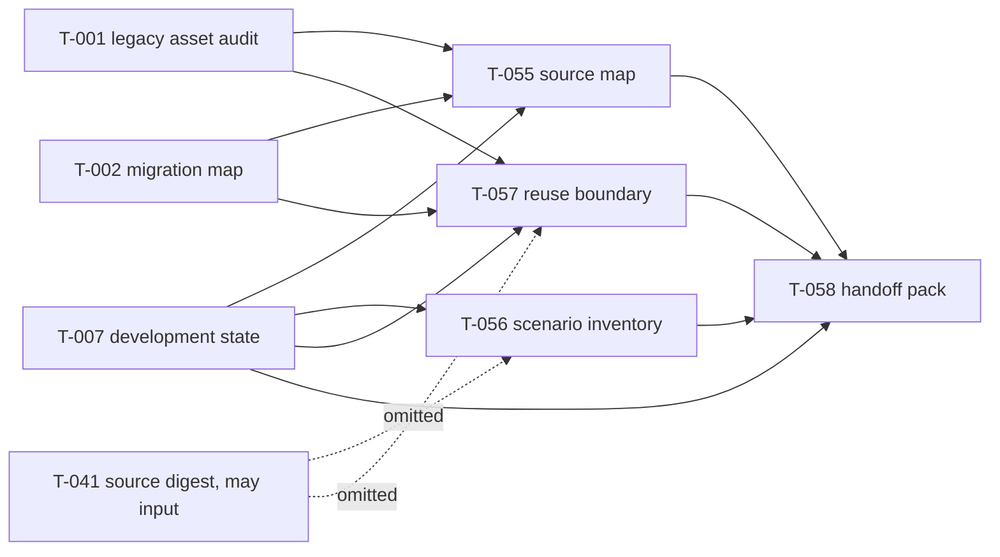

# G-026 legacy_stress_test_asset_digestion DAG 记录日志

生成时间：2026-06-24  
项目：P-012 / 12_PxFquery  
Goal：G-026 `goal_legacy_stress_test_asset_digestion`  
数据来源：CyHex API `GET /api/version`、`GET /api/projects/12_PxFquery/orchestration-state`、各 task `process-record` 与 `completion.md` / `auto_recovery.md` 报告。

## 1. 目标背景

本 DAG 的目的，是在消化阶段提前沉淀后续压力测试里程碑可复用的资产：从已迁移、已登记、已消化的 legacy 材料中整理压力测试、复杂查询、严格/边界查询、旧验证脚本和报告线索。

核心边界：

- 编排层不扫描 legacy root。
- task agents 优先使用 T-001、T-002、T-007 的已消化/已迁移资产。
- 不运行压力测试，不修旧脚本，不把旧脚本当作当前验收标准。
- 产出用于后续开发阶段压力测试里程碑复用。

## 2. DAG 结构

最终状态：T-055、T-056、T-057、T-058 全部 `done`，完成日期均为 2026-06-24。

## 3. 任务清单与交付

| Task | 名称 | 依赖 | 最终状态 | 核心交付 |
|---|---|---|---|---|
| T-055 | `01_legacy_stress_test_source_map` | T-001, T-002, T-007 | done | legacy 压力测试候选资产 source map；候选资产 CSV index |
| T-056 | `02_stress_query_scenario_inventory` | T-007；T-041 为 may 且被 omit | done | 29 个压力测试场景；场景 CSV 表 |
| T-057 | `03_legacy_stress_logic_reuse_boundary` | T-001, T-002, T-007；T-041 为 may 且被 omit | done | 65 个 legacy 资产复用边界判断；decision matrix |
| T-058 | `04_stress_test_development_handoff_pack` | T-055, T-056, T-057, T-007 | done | 压力测试开发 handoff pack；后续压力测试里程碑任务建议 |

T-058 最终 completion 摘要显示：

- 汇总约 160 个候选资产、29 个压力测试场景、65 个 legacy 复用判断。
- 识别 10 个 direct-reference 资产，11 个 rewrite-needed 脚本。
- 汇总 19 个 gap / missing asset / risk 项。
- 推荐 7 个后续压力测试里程碑任务 ST-M01 到 ST-M07。
- 明确保留 4 个未解决歧义：Act-1 authority conflict、suite variant proliferation、GSEA symlinks、mode coexistence。

## 4. 关键执行时间线

### 4.1 T-055 source map

| Stage | 最终状态 | 时间 | 说明 |
|---|---|---|---|
| config | done | 05:05:37 - 05:08:22 | 正常配置完成 |
| check | done | 05:08:24 - 05:20:29 | 首次 check failed，随后重新 check 成功 |
| execute | done | 05:20:30 - 05:52:31 | 多次 interrupted，经 auto-recovery 收口 |
| deliver | done | 05:52:42 - 06:01:44 | 首次 delivery interrupted，经 auto-recovery 收口 |

异常与处理：

- `check` 首次 session `cli_de5c56756481` failed，后续 session `cli_c1ca48d26ac3` 成功。
- `execute` 发生 3 次 interrupted：`cli_debaa6e5037f`、`cli_15934c67f273`、`cli_5b7a3793ec0a`。
- CyHex auto-recovery 依次拉起 `cli_15934c67f273`、`cli_5b7a3793ec0a`、`cli_15cb29e96ad8`，最终 execute done。
- `deliver` session `cli_8fefc997f59a` interrupted，auto-recovery 拉起 `cli_14b08dfaa523`，最终 deliver done。

### 4.2 T-056 scenario inventory

| Stage | 最终状态 | 时间 | 说明 |
|---|---|---|---|
| config | done | 05:05:56 - 05:08:43 | 正常 |
| check | done | 05:08:44 - 05:09:47 | 正常 |
| execute | done | 05:09:49 - 05:11:44 | 正常 |
| deliver | done | 05:11:46 - 05:13:04 | 正常 |

无状态机异常。T-041 仍 active，因此作为 `may` input 被 omit；T-056 仅使用 T-007 登记证据完成。

交付摘要：

- 29 个 scenario。
- 覆盖 9 个维度：complex queries、strict queries、boundary queries、no-hit behavior、overly broad results、proxy/exact matching、difficult combos、LLM mode cross-checks、missing/partial index。
- 未运行查询或压力测试，只产出可复用场景资产。

### 4.3 T-057 reuse boundary

| Stage | 最终状态 | 时间 | 说明 |
|---|---|---|---|
| config | done | 05:06:18 - 05:10:26 | 正常 |
| check | done | 05:10:28 - 05:11:43 | 正常 |
| execute | done | 05:11:44 - 07:02:09 | 大量 interrupted，经 auto-recovery 多轮续跑后收口 |
| deliver | done | 07:02:12 - 07:04:42 | 正常 |

异常与处理：

- `execute` 原始 session `cli_50af59f49aab` interrupted。
- 后续 auto-recovery 链连续拉起：
  - `cli_96dd15acd5ce`
  - `cli_9920709f1690`
  - `cli_202fe24da892`
  - `cli_995c061983eb`
  - `cli_62ec7b412bd7`
  - `cli_6eee11529047`
  - `cli_5f631455bc22`
  - `cli_06fa713a1087`
  - `cli_cae72ba8fe47`
  - `cli_8491b5535b06`
  - `cli_1c93cc4acb93`
- 最终 `cli_1c93cc4acb93` returncode 0，execute done。

处理原则：

- 心跳监控期间未修改 done task。
- 对 T-057 的 repeated interrupted 判断为 CyHex auto-recovery 正在推进，因此没有重复启动额外 session。
- T-041 may input 未完成，按 DAG 规则 omit，不阻塞 T-057。

### 4.4 T-058 handoff pack

| Stage | 最终状态 | 时间 | 说明 |
|---|---|---|---|
| config | done | 07:04:50 - 07:10:15 | 正常 |
| check | done | 07:10:18 - 07:22:58 | 首次 interrupted，auto-recovery 后 green_check |
| execute | done | 07:23:00 - 07:53:46 | interrupted/stalled 后人工心跳有界修复 |
| deliver | done | 07:53:51 - 08:09:24 | 首次 interrupted，auto-recovery 后 done |

异常与处理：

1. `check` 阶段
   - 原始 session：`cli_c9c3674d8454`，status `interrupted`。
   - auto-recovery session：`cli_1efdf94e1a20`，status `done`，returncode 0。
   - `handoff_check_before_exec.md` 给出 `green_check`。
   - 修复判断：可按绿色快速通道继续，不需要人工改写 task 内容。

2. `execute` 阶段第一次异常
   - 原始 session：`cli_9c722234e19b`，status `interrupted`。
   - auto-recovery session：`cli_7b87c7389200`，后来进入 `stalled`，原因是 `no_session_output`，只有 step-start 事件，没有有效 agent output。
   - 同时，T-058 已经写出 `completion.md`，并登记 D-001 / D-002 两个 delivered artifact。

3. `execute` 阶段心跳有界修复
   - 修复动作：通过 CyHex session message 对 stalled session 发出最小续跑指令。
   - 新 session：`cli_58a5e4920205`。
   - prompt_source：`heartbeat_repair`。
   - 修复指令边界：只核对 T-058 自己已有的 completion / artifact registry / 当前任务产物；不扫描 legacy root；不读取任意 predecessor 目录；必要时只补齐任务内报告。
   - 结果：`cli_58a5e4920205` returncode 0，execute done。

4. `deliver` 阶段
   - 原始 session：`cli_126be2427657`，status `interrupted`。
   - auto-recovery session：`cli_fee9ea862c44`，status `done`，returncode 0。
   - 结果：T-058 status `done`。

## 5. 心跳监控与取消

为 G-026 创建过心跳自动化：

- automation_id：`p012-g026-stress-asset-heartbeat`
- 频率：每 10 分钟
- 监控范围：T-055、T-056、T-057、T-058
- 规则：每轮先读 `~/.cyhex/AI.md` 并确认 `/api/version` matched；使用 CyHex API；不扫描 legacy root；T-058 因前置等待不视为异常；done task 不修改。

心跳期间主要动作：

- T-055 check failed 后，重启合法 check session，后续完成。
- T-057 多次 interrupted，但检测到 auto-recovery 持续推进，未重复干预。
- T-058 check interrupted 后确认 auto-recovery green_check。
- T-058 execute stalled 后，通过 session message 做有界修复，生成 `heartbeat_repair` execute session。
- T-058 delivery interrupted 后由 CyHex auto-recovery 收口。
- 四个任务全部 done 后删除心跳自动化。

最终取消状态：

- 取消原因：T-055/T-056/T-057/T-058 全部 done。
- 取消结果：automation `p012-g026-stress-asset-heartbeat` 已 deleted。

## 6. 状态机异常总表

| Task | Stage | 异常状态 | 主要 session | 解决方式 | 最终结果 |
|---|---|---|---|---|---|
| T-055 | check | failed | `cli_de5c56756481` | 重新 check | done |
| T-055 | execute | interrupted | `cli_debaa6e5037f`, `cli_15934c67f273`, `cli_5b7a3793ec0a` | CyHex auto-recovery | done |
| T-055 | deliver | interrupted | `cli_8fefc997f59a` | CyHex auto-recovery | done |
| T-057 | execute | repeated interrupted | 11 个 execute session | CyHex auto-recovery 链持续续跑 | done |
| T-058 | check | interrupted | `cli_c9c3674d8454` | CyHex auto-recovery `cli_1efdf94e1a20` | done / green_check |
| T-058 | execute | interrupted | `cli_9c722234e19b` | CyHex auto-recovery | 后续 stalled |
| T-058 | execute | stalled / no_session_output | `cli_7b87c7389200` | 心跳 session message 有界修复，启动 `cli_58a5e4920205` | done |
| T-058 | deliver | interrupted | `cli_126be2427657` | CyHex auto-recovery `cli_fee9ea862c44` | done |

## 7. 最终交付资产摘要

T-055：

- `4_artifact/2_persist/legacy_stress_test_source_map_v20260624.md`
- `4_artifact/5_table/stress_test_candidate_asset_index_v20260624.csv`

T-056：

- `4_artifact/2_persist/stress_query_scenario_inventory_v20260624.md`
- `4_artifact/5_table/stress_query_scenario_table_v20260624.csv`

T-057：

- `4_artifact/2_persist/legacy_stress_logic_reuse_boundary_v20260624.md`
- `4_artifact/5_table/stress_logic_reuse_decision_matrix_v20260624.csv`

T-058：

- `4_artifact/2_persist/stress_test_development_handoff_pack_v20260624.md`
- `4_artifact/2_persist/recommended_stress_test_milestone_tasks_v20260624.md`

## 8. 结论

G-026 已完成它在消化阶段的目标：把 legacy 中与压力测试、复杂查询、边界查询和旧验证逻辑相关的材料整理为可复用的开发前资产。

从 DAG 质量看，T-056 是最顺畅的并行资产产出；T-055 和 T-057 因 legacy 资产整理范围较重而出现多次执行中断；T-058 作为汇总层在 check、execute、deliver 三个阶段都发生过状态机异常，但均通过 CyHex auto-recovery 或一次有界心跳修复收口。

当前可交付给后续开发阶段复用的核心资产是 T-058 的 handoff pack 和 recommended milestone tasks；它们已经把 source map、scenario inventory、reuse boundary 与 T-007 development state 对齐，适合作为后续压力测试里程碑的输入。
