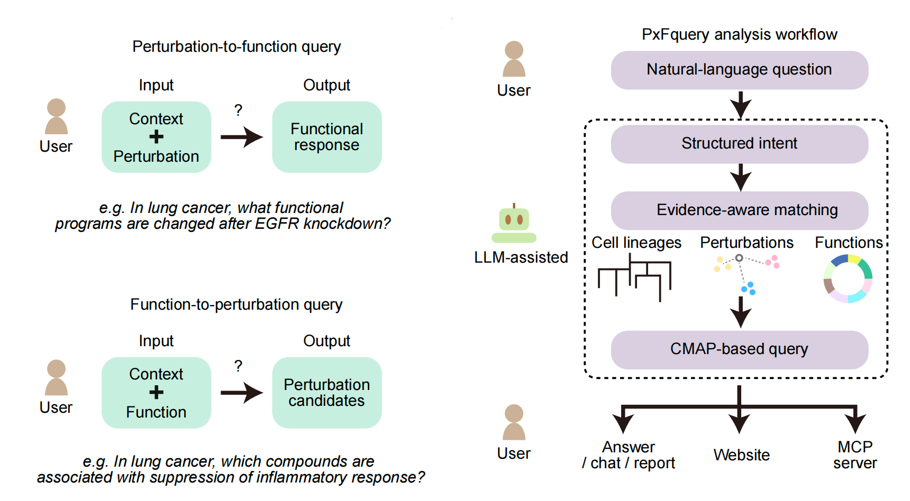

# PxFquery

**PxFquery** is an LLM-assisted perturbation biology query engine. It turns a natural-language biological question into evidence-aware matches over LINCS / Connectivity Map-style perturbation signatures, then returns a user-facing biological answer, reusable evidence tables, figures, HTML reports, chat follow-up, CLI output, and MCP-compatible payloads.

PxFquery is not a keyword lookup wrapper. Its core use case is asking biological questions where the context, perturbation, function, and direction may be explicit or approximate.

## Core Idea



PxFquery supports two complementary query directions:

- **Perturbation-to-function query**: given a biological context and a perturbation, estimate which functional programs change.
- **Function-to-perturbation query**: given a biological context and a desired functional state, rank perturbation candidates associated with that state.

The analysis workflow is:

```text
natural-language question
  -> structured intent
  -> evidence-aware matching across cell context, perturbation, and function resources
  -> CMap-style matrix query
  -> biological answer, evidence object, figures, HTML report, chat, CLI, or MCP response
```

The language model is used for semantic interpretation and evidence-grounded answer organization. Matrix-backed functional evidence, metadata, and resource indexes drive the biological result.

## Example Questions

**Forward: drug perturbation**

```text
For EGFR-driven lung adenocarcinoma models, what functional programs are changed by Erlotinib, and are inflammatory or MAPK-related programs affected?
```

**Forward: genetic perturbation**

```text
In A549 lung cancer cells, what functional programs are changed after EGFR CRISPR knockout?
```

**Reverse: drug perturbation**

```text
In a lung adenocarcinoma model, which drugs are linked to suppression of inflammatory response and preservation of oxidative phosphorylation?
```

**Reverse: genetic candidates**

```text
In melanoma models, which genetic knockdown perturbations are linked to suppression of EMT programs?
```

## What PxFquery Returns

PxFquery keeps one evidence object and renders it through multiple outlets.

| Outlet | Purpose |
| --- | --- |
| `print(answer)` | A biological answer for the user, followed by a short source/evidence note. |
| Python answer object | Structured access to summary text, biological results, tables, figures, and evidence metadata. |
| Evidence tables | Matched contexts, perturbations, functional programs, scores, and provenance fields for inspection. |
| Figures | Query-specific evidence visualizations. Forward queries include evidence-match maps and program-support summaries; reverse queries include candidate-ranking views and function-match views. |
| HTML report | A readable report with the question, answer, figures, run-quality summary, and package version. |
| Chat | Follow-up questions over the same evidence object. Chat requires a configured LLM provider and has no local template fallback. |
| CLI | Terminal access to answer, JSON, HTML, figures, and chat commands. |
| MCP server | Tool-compatible access for external AI analysis environments. |

The same parsed evidence object can be saved and reloaded for later presentation-layer work.

## Installation

```bash
git clone git@github.com:caodudu/pxfquery.git
cd pxfquery
python -m pip install -e .
```

PxFquery requires Python 3.10 or newer.

## Resource Pack

PxFquery uses an internal resource manifest and downloads required matrices, metadata, and indexes into the user cache when needed. Users normally do not need to provide external CSV files.

```python
from pxfquery import PxFQuery

pxf = PxFQuery()
print(pxf.resources.status())
```

Advanced users with a local mirror can mount it explicitly:

```python
pxf.resources.use("/path/to/pxfquery_resource_pack")
```

## LLM Configuration

PxFquery needs a configured LLM endpoint for semantic parsing, biological answer synthesis, evidence-audit text, and chat follow-up.

Environment-variable configuration:

```bash
export PXFQUERY_LLM_API_KEY="..."
export PXFQUERY_LLM_BASE_URL="https://your-provider.example/v1"
export PXFQUERY_LLM_MODEL="your-model-name"
export PXFQUERY_LLM_PROVIDER="your-provider-name"
```

Python configuration:

```python
from pxfquery import PxFQuery

pxf = PxFQuery()
pxf.settings.register_llm_provider(
    name="my-provider",
    token="...",
    base_url="https://your-provider.example/v1",
    model="your-model-name",
    timeout=60,
)
```

DeepSeek helper:

```python
pxf.settings.use_deepseek(token="...", timeout=60)
```

## Quick Start

```python
from pxfquery import PxFQuery

pxf = PxFQuery()

q = pxf.tl.parse(
    "For EGFR-driven lung adenocarcinoma models, what functional programs are changed "
    "by EGFR inhibition, and are inflammatory or MAPK-related programs affected?",
    top_n=10,
)
pxf.tl.answer(q)
answer = pxf.get.answer(q)

print(answer)
```

`pxf.tl.parse()` performs semantic parsing, evidence-aware matching, matrix execution, and evidence assembly. `pxf.tl.answer()` renders the assembled evidence into user-facing outputs.

Executed GitHub demos are available in [`demo/`](demo/):

1. forward query
2. reverse query
3. figures
4. client and answer object
5. chat
6. MCP placeholder

## Forward and Reverse Queries

```python
forward = pxf.tl.parse(
    "In A549 lung cancer cells, what functional programs are changed by doxorubicin treatment?",
    top_n=10,
)
pxf.tl.answer(forward)
print(pxf.get.answer(forward))

reverse = pxf.tl.parse(
    "In MCF7 breast cancer cells, which drug perturbations are linked to activation of apoptosis programs?",
    top_n=10,
)
pxf.tl.answer(reverse)
print(pxf.get.answer(reverse))
```

Forward queries rank functional responses for matched context-perturbation evidence. Reverse queries rank perturbation candidates against requested functional criteria.

## Python Answer Object

```python
answer = pxf.ask(
    "For melanoma models treated with BRAF inhibitors, which functional programs change?",
    mode="python",
)

print(answer.summary)
print(answer.biological_results[:5])
print(answer.tables.keys())
```

Common fields:

- `summary`: biological answer text.
- `biological_results`: ranked functional programs or perturbation candidates.
- `tables`: display-ready evidence tables such as match summaries and functional results.
- `figures`: figure specifications used by report and file outputs.
- `evidence`: compact metadata for source, run quality, and evidence provenance.

## HTML Reports and Figures

```python
q = pxf.tl.parse(
    "In lung adenocarcinoma models, which drug perturbations are linked to suppression of MYC target programs?",
    top_n=10,
)
pxf.tl.answer(q)

pxf.tl.figures(q, output_dir="pxfquery_figures", format="pdf")
pxf.tl.answer(q, mode="html", output="lung_myc_report.html")
```

The HTML report is intentionally simple: question, biological answer, figures, run-quality report, and package version. It avoids table-heavy debug dumps in the main report body.

Figure files default well for manuscript or notebook inspection; PDF output keeps editable text for Illustrator-style workflows.

## Follow-up Chat

```python
q = pxf.tl.parse(
    "In melanoma models, which genetic knockdown perturbations are linked to suppression of EMT programs?",
    top_n=10,
)
pxf.tl.answer(q)

pxf.tl.chat(
    q,
    "Using only the current evidence object, identify the best-supported knockdown candidates "
    "and note uncertainty in target identity or model matching.",
)
print(pxf.get.chat(q))
print(pxf.get.chat_history(q))
```

Chat answers are constrained to the assembled evidence object. PxFquery does not silently replace chat with a local template when no LLM provider is configured.

## Save and Reload a Query Object

```python
q = pxf.tl.parse(
    "In breast cancer models, what functional programs are changed after MYC RNAi knockdown?",
    top_n=10,
)
pxf.tl.answer(q)

pxf.tl.save(q, "myc_breast_query.pkl")
q2 = pxf.tl.load("myc_breast_query.pkl")
print(pxf.get.answer(q2))
```

This is useful when a query has already run and you want to regenerate L5 outputs such as HTML, figures, or chat later.

## Command Line

```bash
pxfquery answer "In a lung adenocarcinoma model, which perturbations are linked to suppression of inflammatory response and preservation of oxidative phosphorylation?"
```

Write an HTML report:

```bash
pxfquery answer \
  "For EGFR-driven lung adenocarcinoma models, what functional programs are changed by EGFR inhibition?" \
  --mode html \
  --output egfr_lung_report.html
```

Write figure files:

```bash
pxfquery figures \
  "In melanoma models, which drug perturbations are linked to suppression of EMT programs while preserving or activating apoptosis programs?" \
  --output-dir melanoma_reverse_figures \
  --format pdf
```

Run evidence-grounded chat from the command line:

```bash
pxfquery chat \
  "In A549 lung cancer cells, what functional programs are changed after EGFR CRISPR knockout?" \
  "Using only the current evidence object, explain whether the pattern supports reduced growth signaling."
```

Use an environment file:

```bash
pxfquery --env-file .env answer "Which genetic perturbations may reduce MYC-related programs in a breast cancer context?"
```

## Optional Annotation

The primary result is matrix-backed. Optional annotation can add public database context after the query result exists:

```python
q = pxf.tl.parse(
    "Which compounds are associated with suppression of interferon response in a lung cancer context?",
    top_n=10,
)
pxf.tl.answer(q)
pxf.tl.anno(q, sources=("chembl",), timeout=5)

annotation = q.uns["annotation_evidence"]
```

Annotation is supplementary; it should not replace the matrix evidence used for ranking.

## MCP Interface

PxFquery can run as an MCP server:

```bash
python -m pxfquery.mcp_server --env-file .env
```

Available tools:

- `pxfquery_parse_answer`: run a query and return an answer payload.
- `pxfquery_render_figures`: run a query and write figure files.
- `pxfquery_l5_chat`: answer a follow-up using the assembled evidence.

## Version

```python
import pxfquery
print(pxfquery.__version__)
```

Current package version:

```text
0.5.12.dev0
```
